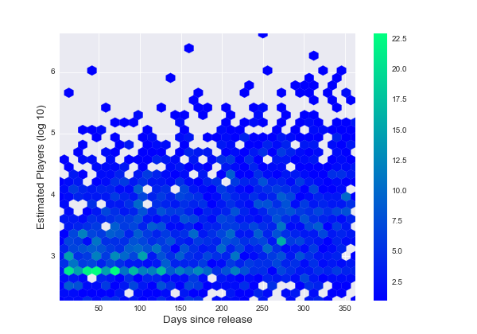
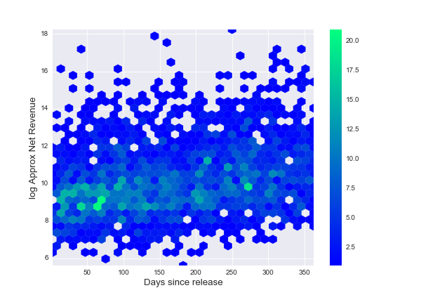

# Steam Spy Data

## Estimating Profit

We estimate profit by taking the product of the owners given by Steam Spy and the price. This obviously doesn't account for sales, free keys and so on. Since the number of owners and the price were used to produce the target variable we could not use them as features.

This is a limitation of the data, as including the price point selected would be interesting.

Notice there is an artifact just under 10^3 (or around 500) players. I'm guessing this is either from steamspy or by how the data is collected.

There is a weak relationship here.

I would have liked to see the proportion of players with positive playtime, since many accounts will have games that have never been launched, and I'm sure that skews this data.

## Generating Features

Examining common words taken from the titles reveals:

| Word  | Count |
|-------|-------|
| the   |   374 |
| of    |   233 |
| vr    |   102 |
| 2     |    63 |
| a     |    62 |
| space |    55 |
| and   |    46 |
|in        | 37 |
|super     | 32 |
| game     | 27 |
|world     | 27 |
|adventure | 26 |
|edition   | 26 |
|simulator | 26 |
|to        | 26 |
|one       | 21 |
|heroes    | 18 |
|island    | 17 |
|for       | 17 |
|lost      | 17 |

So I included 'VR', '2', 'Space', and 'Super' as indicator features if they were present in the title.

## Linear Regression

While many of these features would benefit from transforms to make them fit a normal distribution, the real outcome we want is to know the linear weights of those features, so the only transform is to remove the mean from the number of players, and the mean and median playtimes. This makes the intercept more easily interpreted.

The regression almost wholly relies on the number of Players as feature. The R^2 drops from 0.857 to 0.140 without this feature. This will be due to the high correlation between the number of Players and the number of Owners.

| Feature               |   Coefficient | 
|-----------------------|---------------|
|Avg Playtime meaned    |        6.8    |
|Median Playtime meaned |       -3.9    |
|Players meaned         |       18.5    |
|is_RPG                 |   -91339.3    |
|is_puzzle              |  -285090.6    |
|is_platformer          |  -181062.4    |
|is_sandbox             |   132384.9    |
|is_simulation          |   -85141.8    |
|is_strategy            |   -86374.0    |
|is_survival            |   263060.5    |
|HasScore               |   -94658.9    |
|HasScore>50%           |    -8945.2    |
|DaysSinceRelease       |     -461.2    |
|VRInTitle              |    45168.0    |
|2InTitle               |   126918.9    |
|SpaceInTitle           |   -76115.2    |
|SuperInTitle           |   -75600.4    |
|intercept              |   460374.0    |

So we see that the 'best' game we could create would be an indie sandbox survival game, with a title that mentions VR and is a sequel.

The postive value of being a sequel is probably a sort of filter effect. Bad games will be less likely to generate a sequel.
